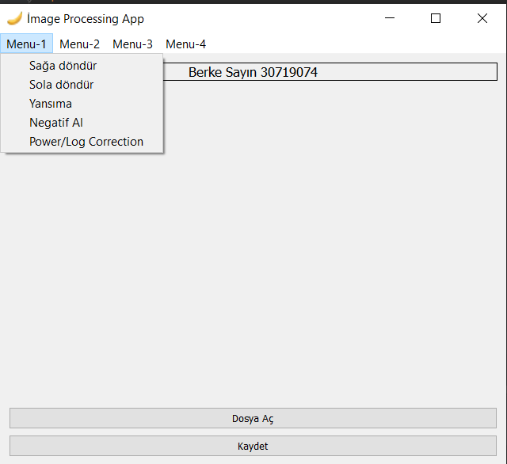
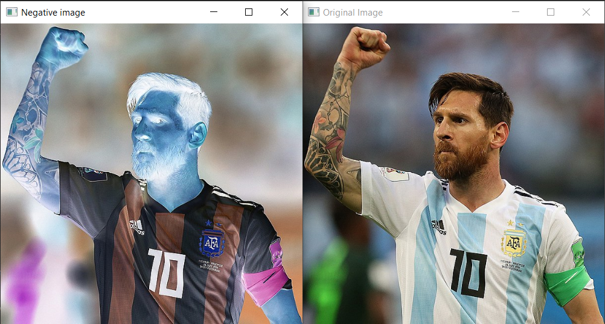
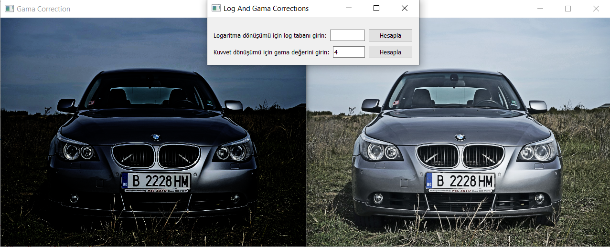
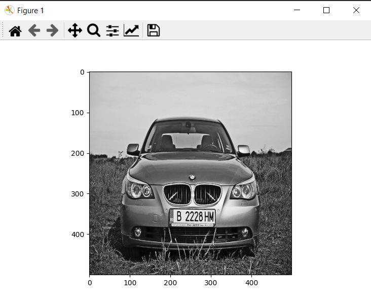
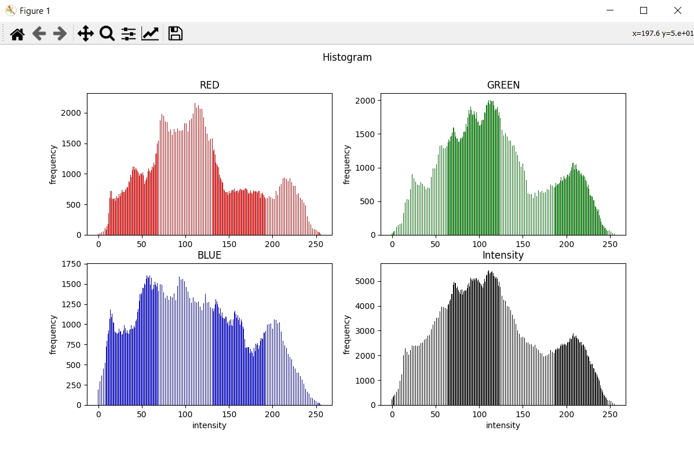
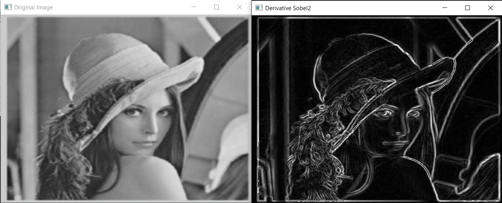
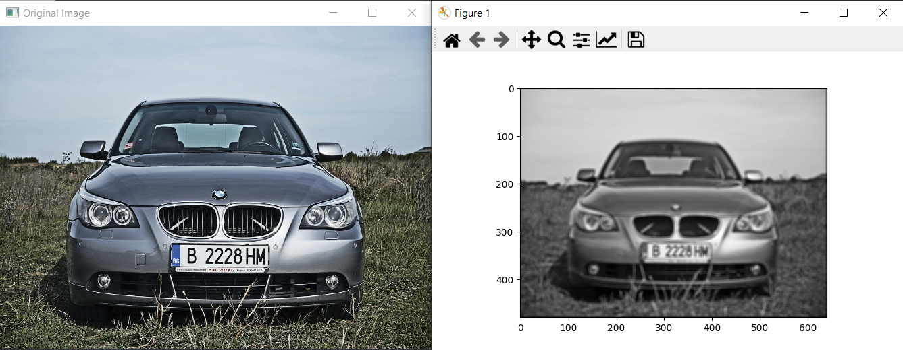
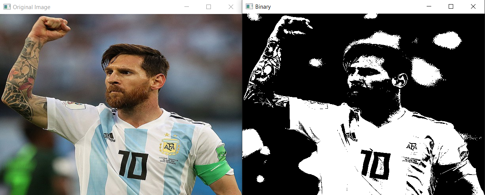
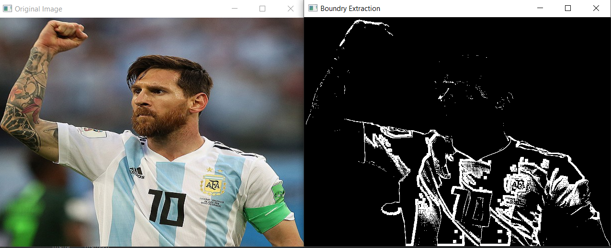

## Image Processing Application
==================================================
#### ***This project contains examples of image processing applications. I made an user interface by using pyqt5 libraries.***

### Project Content
`Here is the list of Menubar and its contents`
- [Menu-1](#m1)
  - Turn right
  - Turn left
  - Reflection
  - Negative
  - Gama Correction
  - Log Transformation
- [Menu-2](#m2)
  - Gray Scale
  - Histogram Graph
  - Histogram Equalization
- [Menu-3](#m3)
  - Derivative
  - Low Pass Filter
  - High Pass Filter
- [Menu-4](#m4)
  - Otsu Threshold
  - Erosion
  - Dilation
  - Opening
  - Closing
  - Boundry Extraction

### Process Examples
`Here some examples of image procassing application`

- #### Menu-1 
    
    > Negative image
    

    
    >Gama Correction
    

- #### Menu-2 

    >Gray Scale
    

    >Histogram Graph
    

- #### Menu-3 

    >Derivative
    

    >Low Pass Filter
    

- #### Menu-4 

    >Otsu Thresholding
    

    >Boundry Extraction
    

